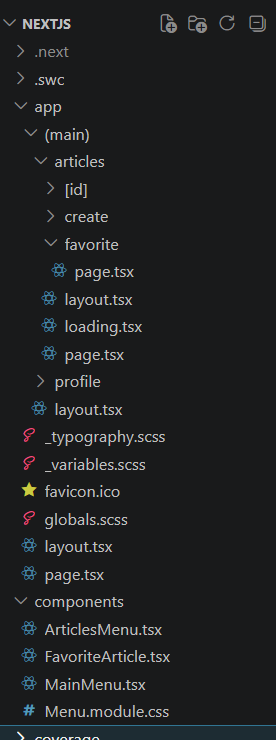
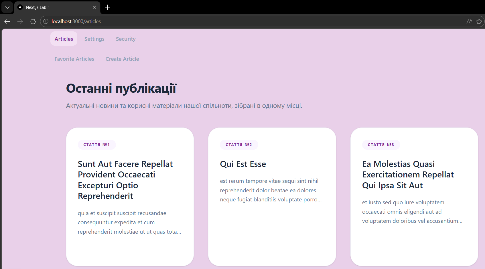
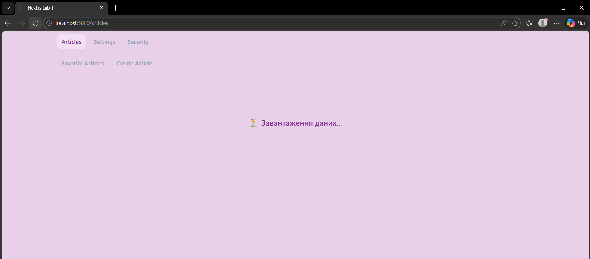
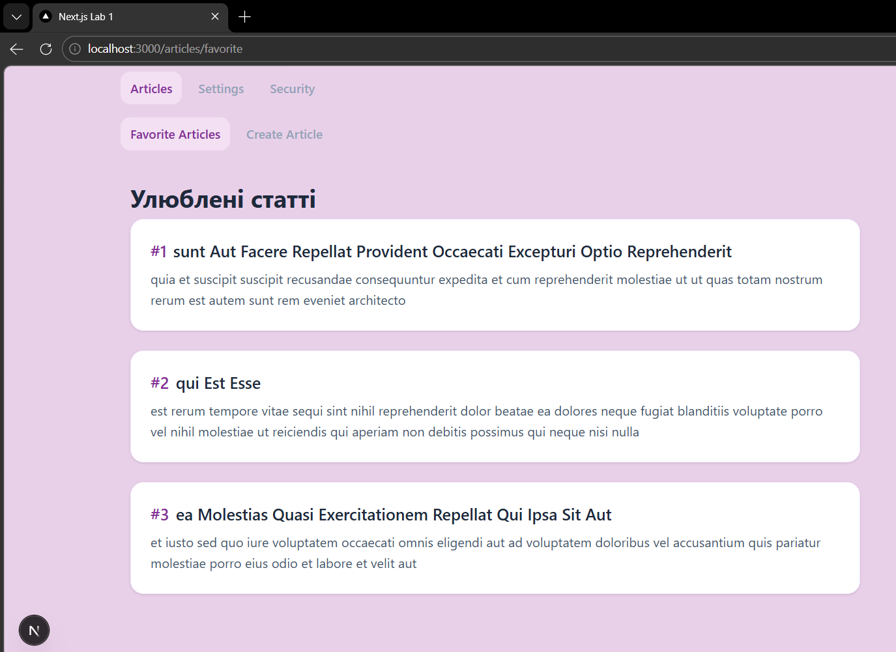
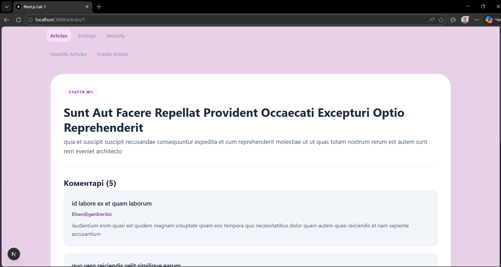
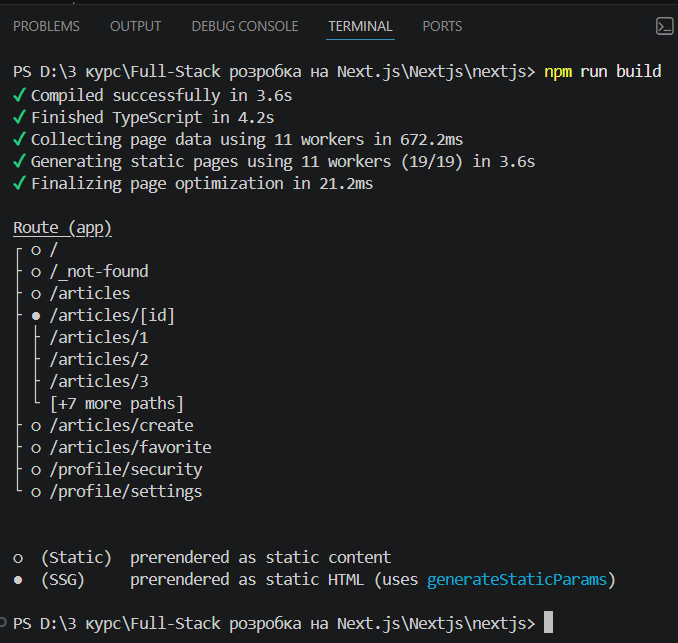
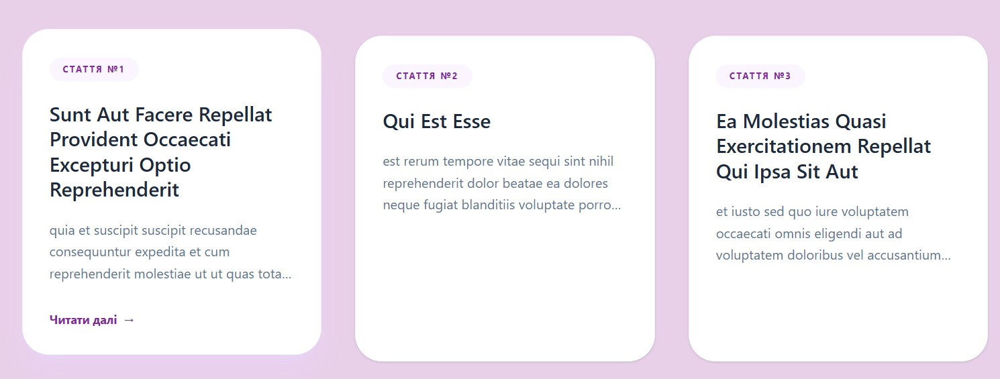

# Лабораторна робота №1: Розгортання проекту. Створення сторінок. Стилізація

**Стек технологій:** Next.js (App Router), TypeScript, SCSS, CSS Modules, Tailwind CSS.

## Завдання 1: Розгортання проєкту та структура
- Проєкт розгорнуто за допомогою `npx create-next-app` із використанням TypeScript та Tailwind CSS.
- Налаштовано зручну архітектуру папок згідно з парадигмою App Router.
- Використано глобальні стилі (`globals.scss`, `_variables.scss`, `_typography.scss`).

**Скріншот структури проєкту:**

---

## Завдання 2: Створення сторінок та навігації
- Створено систему маршрутизації зі сторінками: `/articles`, `/articles/favorite`, `/articles/create`, `/profile/settings`, `/profile/security`.
- Реалізовано загальний `layout` для всіх сторінок та вкладений навігаційний `layout` для розділу `/articles`.
- Додано функціонал підсвічування активного пункту меню (як головного, так і підменю).

**Скріншот активного меню (головне меню):**

---

## Завдання 3: Отримання даних (Fetch & SSG)
- **Списки:** Налаштовано GET-запити до `jsonplaceholder.typicode.com/posts` для отримання списку публікацій.
- **Стан завантаження:** Реалізовано кастомний компонент завантаження (Loading UI), який відображається під час очікування даних.
- **Улюблені статті:** Виведено три конкретні статті на сторінці `/articles/favorite` за допомогою компонента `FavoriteArticle`.
- **Динамічний роутинг:** Створено сторінку `/articles/[id]` для відображення конкретної статті та її коментарів.
- **Static Site Generation (SSG):** Налаштовано статичну генерацію (через `generateStaticParams`) для статей з ID від 1 до 10 під час білду.

**Скріншоти:**

- Стан завантаження: 

- Улюблені статті (3 окремі запити): 

- Динамічна сторінка статті з коментарями: 

- SSG Білд у терміналі (видно генерацію сторінок 1-10): 

---

## Завдання 4 та 5: Стилізація і Дизайн
- Налаштовано глобальні CSS-змінні та модульні стилі (`Menu.module.css`).
- Дизайн адаптивний (responsive), реалізовано приємну кольорову палітру та типографіку.
- Картки статей гармонійно стилізовані з використанням ефектів наведення та тіней.

**Скріншот стилізації компонентів:**

