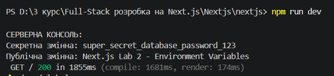
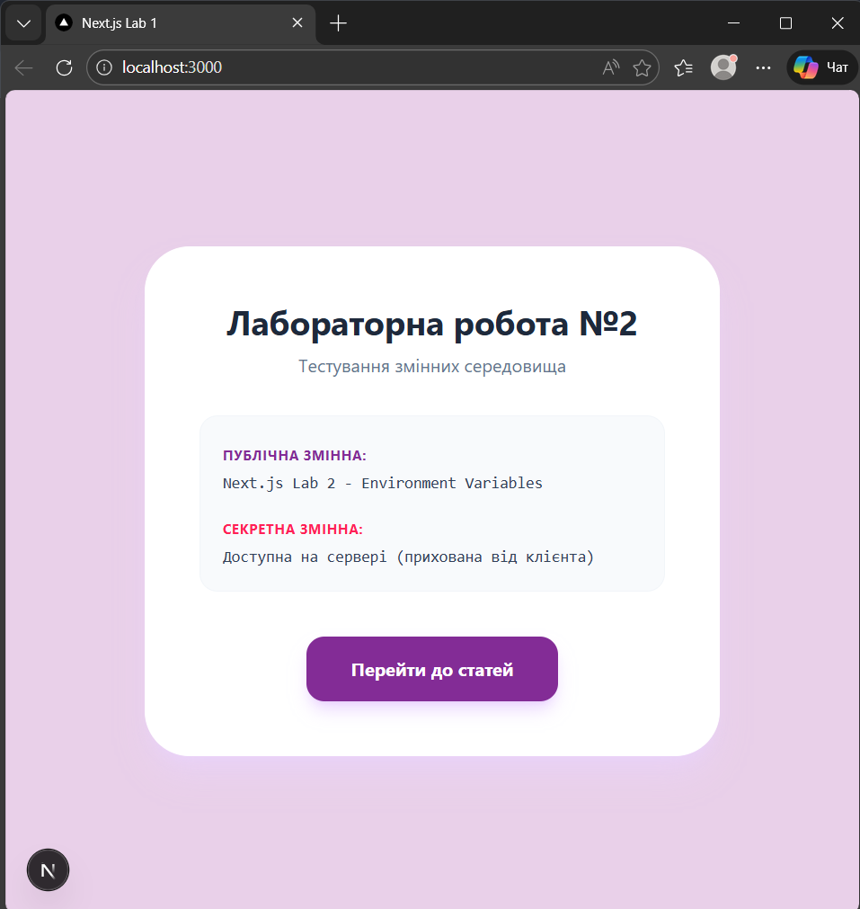
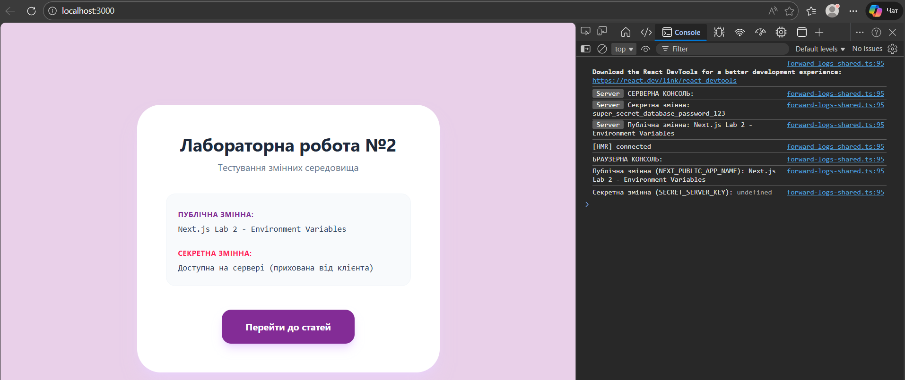

# Лабораторна робота №2. Керування середовищами та Бази Даних

## Завдання 1: Змінні середовища

У цьому завданні було створено файл `.env.local` із секретною та публічною (з префіксом `NEXT_PUBLIC_`) змінними. Файл `.env.local` ігнорується Git для безпеки серверних паролів.

**1. Виведення секретної та публічної змінної в консоль сервера:**

**2. Виведення значень змінних на веб-сторінку:**

**3. Виведення в консоль браузера (секретна змінна залишається undefined):**

---