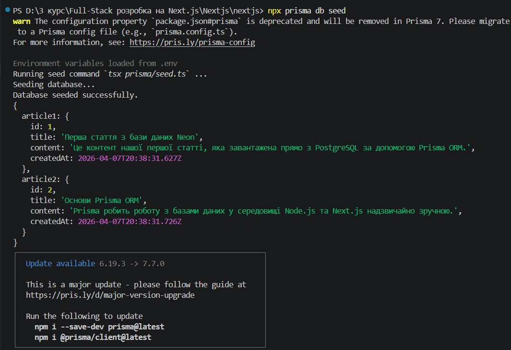

# Лабораторна робота №2. Керування середовищами та Бази Даних

## Завдання 1: Змінні середовища

У цьому завданні було створено файл `.env.local` із секретною та публічною (з префіксом `NEXT_PUBLIC_`) змінними. Файл `.env.local` ігнорується Git для безпеки серверних паролів.

**1. Виведення секретної та публічної змінної в консоль сервера:**

**2. Виведення значень змінних на веб-сторінку:**

**3. Виведення в консоль браузера (секретна змінна залишається undefined):**

---

## Завдання 2. Налаштування бази даних (PostgreSQL + Prisma)
- Створено хмарну базу даних на платформі Neon (через Vercel).
- Встановлено та налаштовано ORM Prisma.
- Змінні для підключення (`DATABASE_URL`, `DATABASE_URL_UNPOOLED`) додано до локального оточення.
- Створено схему бази даних (таблиця `Article`) у файлі `schema.prisma`.
- Написано та успішно виконано скрипт `seed.ts` для початкового наповнення бази даних тестовими статтями.

**Скріншот успішного підключення та наповнення (Seed):**

---

## Завдання 3. Створення Dev бази даних
- Створено ізольовану гілку (branch) `dev` у базі даних Neon для локальної розробки.
- Розділено конфігурацію: створено файли `.env.production` (для головної бази) та `.env.development` (для dev-бази). Файл `.env.local` видалено для уникнення конфліктів.
- Встановлено утиліту `dotenv-cli` для примусового вказування файлу оточення.
- Успішно виконано синхронізацію (`db push`) та наповнення (`db seed`) dev-бази.

**Скріншот наповнення Dev-бази:**
