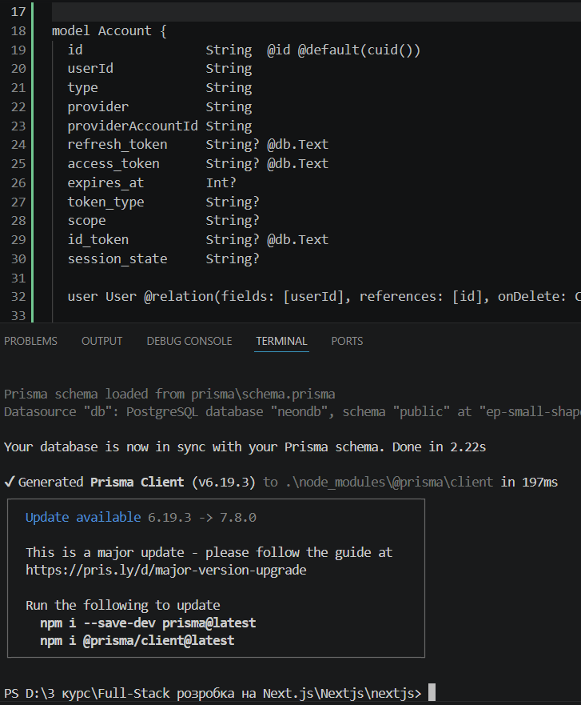

# Лабораторна робота №3: OpenID Connect та Аутентифікація

## Виконано на базі ЛР №2
**Стек технологій:** Next.js (App Router), TypeScript, Prisma ORM, Neon PostgreSQL, NextAuth.js, SWR.

---

## Завдання 1. Додавання таблиці з користувачами
- Встановлено необхідні пакети для роботи з авторизацією: `next-auth`, `@next-auth/prisma-adapter` та `bcryptjs`.
- Оновлено схему бази даних (`prisma/schema.prisma`).
- Створено модель `User` з унікальним полем `email` для ідентифікації користувачів із різних сервісів (Google, GitHub, Credentials).
- Додано технічні моделі `Account`, `Session` та `VerificationToken`, які потрібні для роботи NextAuth під капотом.
- Схему успішно синхронізовано з хмарною базою даних Neon.

**Скріншот результату синхронізації бази даних:**
