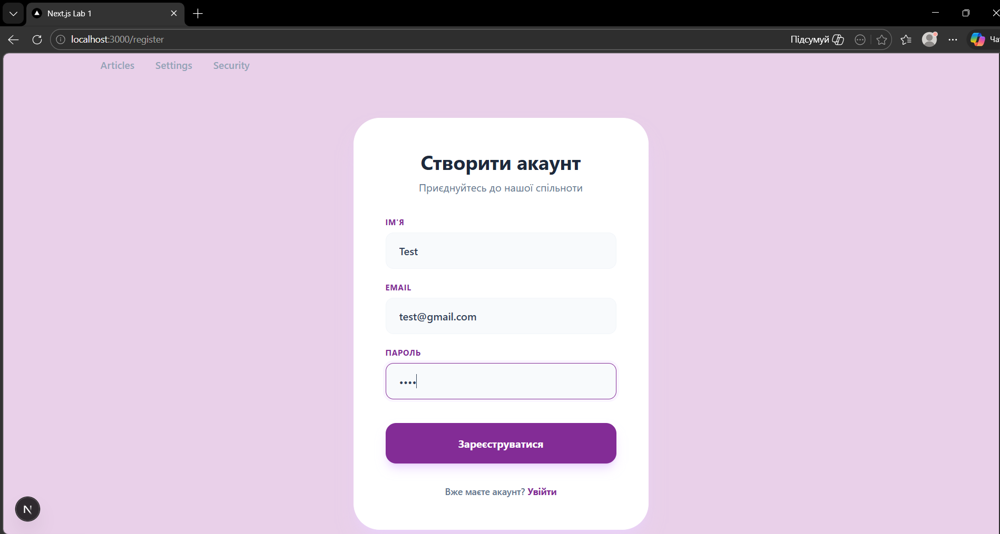
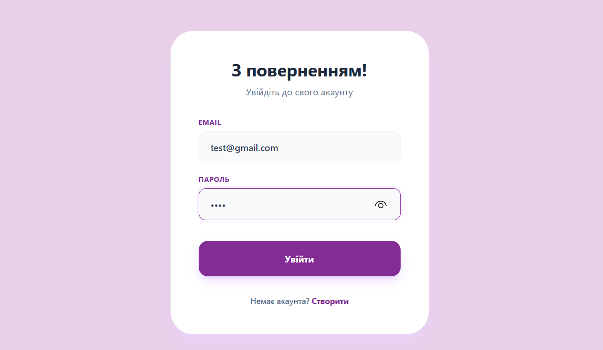
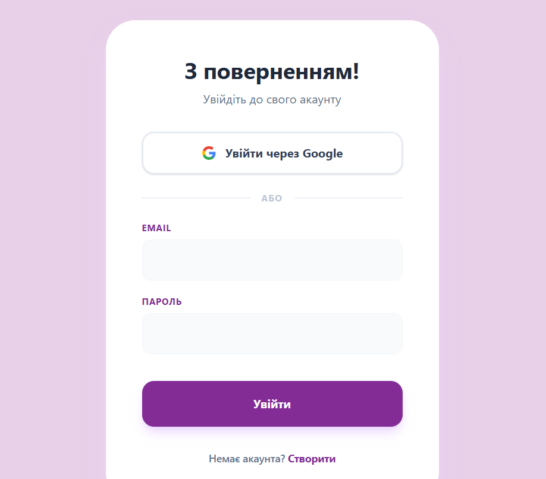
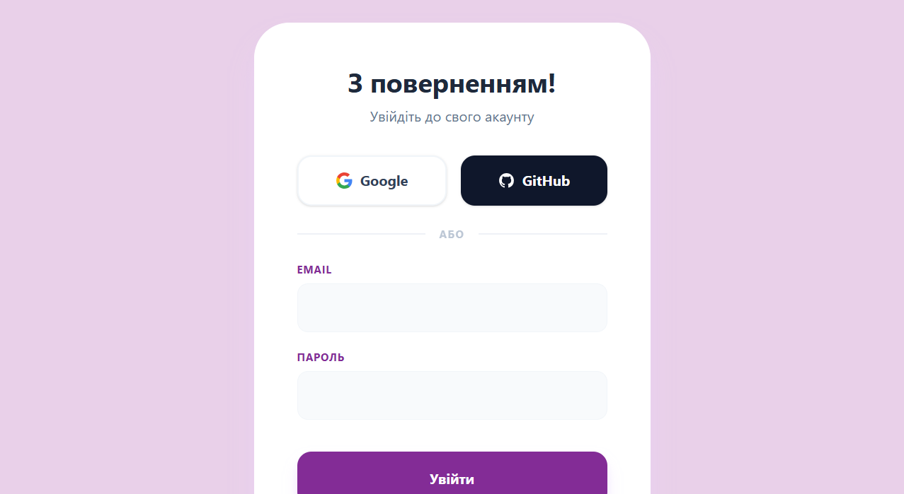
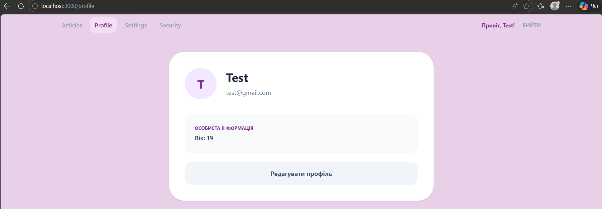
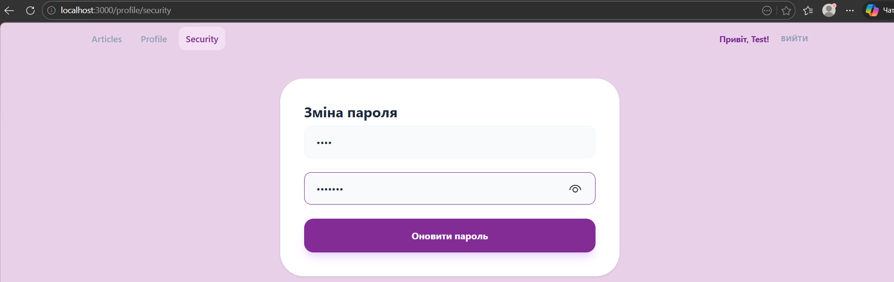

# Лабораторна робота №3: OpenID Connect та Аутентифікація

---

## Завдання 1. Додавання таблиці з користувачами
- Встановлено необхідні пакети для роботи з авторизацією: `next-auth`, `@next-auth/prisma-adapter` та `bcryptjs`.
- Оновлено схему бази даних (`prisma/schema.prisma`).
- Створено модель `User` з унікальним полем `email` для ідентифікації користувачів із різних сервісів (Google, GitHub, Credentials).
- Додано технічні моделі `Account`, `Session` та `VerificationToken`, які потрібні для роботи NextAuth під капотом.
- Схему успішно синхронізовано з хмарною базою даних Neon.

**Скріншот результату синхронізації бази даних:**

---

## Завдання 2. Аутентифікація через логін/пароль
- Налаштовано провайдер `CredentialsProvider` у конфігурації `NextAuth`.
- Створено власний API-маршрут `/api/auth/register` для реєстрації нових користувачів із безпечним хешуванням паролів (бібліотека `bcryptjs`).
- Розроблено клієнтські сторінки реєстрації (`/register`) та входу (`/login`) у єдиному фірмовому стилі проєкту.
- Додано автоматичне перенаправлення на захищені сторінки після успішної авторизації та обробку помилок (наприклад, якщо такий email вже існує).

**Скріншот сторінки реєстрації:**

**Скріншот сторінки входу (Логін):**

---

## Завдання 3. Аутентифікація через Google
- Налаштовано проєкт у Google Cloud Console (створено OAuth Client ID та Client Secret).
- Додано `GoogleProvider` до конфігурації `NextAuth` для підтримки безпечного входу через обліковий запис Google.
- Оновлено клієнтську сторінку входу (`/login`): інтегровано кнопку "Увійти через Google" із використанням функції `signIn('google')` від `next-auth/react`.
- Забезпечено автоматичне створення користувача в базі даних PostgreSQL (через Prisma Adapter) при першому вході через Google.

**Скріншот оновленої сторінки входу з кнопкою Google:**

---

## Завдання 4. Аутентифікація через GitHub
- [cite_start]Зареєстровано OAuth додаток у налаштуваннях розробника GitHub (отримано Client ID та Client Secret)[cite: 14].
- [cite_start]Інтегровано `GithubProvider` до конфігурації `NextAuth`.
- Оновлено клієнтську сторінку входу: додано стилізовану кнопку "GitHub" поруч із кнопкою Google для швидкої авторизації за допомогою `signIn('github')`.
- Налаштовано безшовну інтеграцію даних користувачів з GitHub до бази даних Neon PostgreSQL.

**Скріншот оновленої сторінки входу з кнопками провайдерів:**

---

## Завдання 5. Профіль користувача та безпека
- Оптимізовано структуру маршрутів (видалено зайву сторінку налаштувань).
- Створено захищену сторінку профілю `/profile` з можливістю редагування особистих даних.
- Реалізовано сторінку `/profile/security` для безпечної зміни пароля.
- Оновлено головне навігаційне меню: додано персоналізоване вітання залогіненого користувача та функціонал виходу із системи.

**Скріншоти:**

