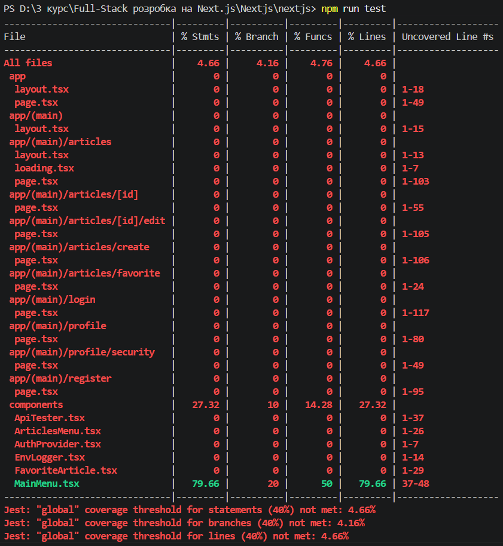

# Лабораторна робота №4: Тестування та CI

## Завдання 1-2. Налаштування Jest та порогу покриття
- Встановлено фреймворк `jest`, `@testing-library/react` та необхідні залежності.
- Створено конфігураційні файли `jest.config.js` та `jest.setup.js`.
- Налаштовано мінімальний поріг покриття коду тестами (coverage threshold) на рівні 40% (branches, functions, lines, statements).
- Написано базовий юніт-тест для компонента `MainMenu` з імітацією хуків `useSession` та `usePathname`.

**Скріншот звіту про покриття тестами (Coverage Report):**

---
