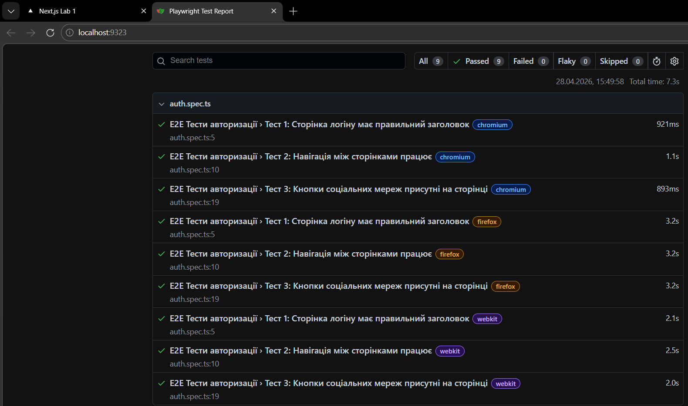
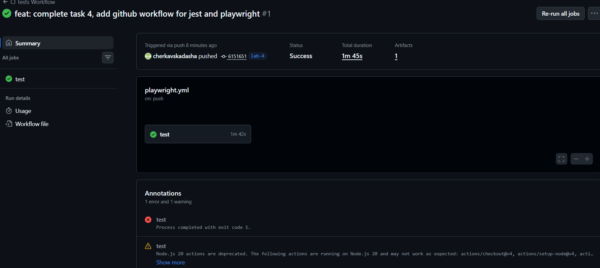

# Лабораторна робота №4: Тестування та CI

## Завдання 1-2. Налаштування Jest та порогу покриття
- Встановлено фреймворк `jest`, `@testing-library/react` та необхідні залежності.
- Створено конфігураційні файли `jest.config.js` та `jest.setup.js`.
- Налаштовано мінімальний поріг покриття коду тестами (coverage threshold) на рівні 40% (branches, functions, lines, statements).
- Написано базовий юніт-тест для компонента `MainMenu` з імітацією хуків `useSession` та `usePathname`.

**Скріншот звіту про покриття тестами (Coverage Report):**

---

## Завдання 3. Налаштування Playwright для E2E тестування
- Ініціалізовано фреймворк Playwright у проєкті (папка `tests/`).
- Створено файл `auth.spec.ts` із трьома e2e-тестами для перевірки сторінок авторизації.
- Налаштовано перевірку рендерингу заголовків, навігації між сторінками (реєстрація/вхід) та наявності кнопок соціальних мереж.
- Тести успішно пройдені у трьох браузерних рушіях (Chromium, Firefox, WebKit).

**Скріншот успішного проходження e2e тестів:**

---

## Завдання 4. Налаштування GitHub Workflow
- Оновлено автоматизований пайплайн (CI) у файлі `.github/workflows/playwright.yml`.
- Налаштовано послідовний запуск юніт-тестів (Jest) та e2e тестів (Playwright) при кожному push/pull_request.
- Додано `continue-on-error: true` для кроку Jest, щоб дозволити виконання e2e тестів навіть при недосягненні порогу покриття у 40%.
- Налаштовано автоматичний запуск локального сервера (`npm run dev`) силами Playwright перед початком e2e тестування.

**Скріншот успішного виконання GitHub Actions:**
